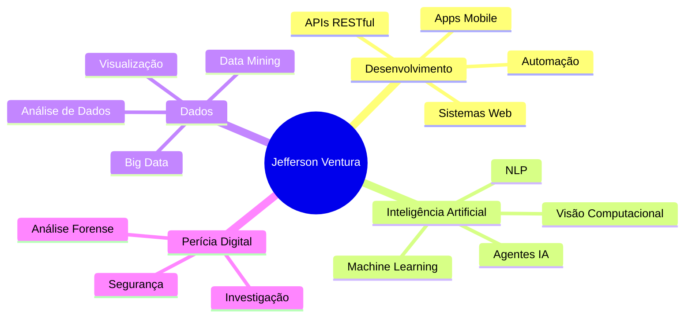

  
# 👋 Olá, sou Jefferson Ventura

### Desenvolvedor Full Stack | Especialista em IA & Automação | Analista de Dados

---

## 🚀 Sobre Mim

Apaixonado por tecnologia e inovação, atuo no desenvolvimento de soluções completas que transformam processos complexos em experiências simples e eficientes. Minha expertise abrange:

- 🤖 **Inteligência Artificial**: Desenvolvimento de agentes inteligentes e sistemas autônomos
- ⚙️ **Automação**: Scripts, crawlers, bots e automação de processos (RPA)
- 🔍 **Perícia Digital**: Análise forense e investigação de dados
- 📊 **Data Science**: Análise de dados, visualização e insights estratégicos
- 💻 **Desenvolvimento**: Sistemas web, APIs e aplicações multiplataforma

---

## 🛠️ Stack Tecnológica

### Linguagens de Programação

  
  
  
  
  
  
  
  

### Inteligência Artificial & Machine Learning

  
  
  
  
  
  

### Frontend & Mobile

  
  
  
  
  
  

### Backend & Frameworks

  
  
  
  
  

### Bancos de Dados

  
  
  
  
  
  
  
  
  

### DevOps & Cloud

  
  
  
  
  
  

### Ferramentas & Automação

  
  
  
  
  

---

## 📈 Áreas de Atuação

---

## 💡 Especialidades

- ✅ Desenvolvimento de **Agentes de IA** conversacionais e autônomos
- ✅ **Automação de processos** (RPA) com Python, JavaScript e Bash
- ✅ **Web Scraping** e extração de dados (Puppeteer, Selenium)
- ✅ **Análise forense digital** e recuperação de dados
- ✅ **Data Science**: análise, visualização e modelagem preditiva
- ✅ Desenvolvimento **Full Stack** (frontend, backend, databases)
- ✅ **DevOps**: containerização, CI/CD, cloud computing

---

## 📫 Vamos Conectar?

**📧 Entre em contato para projetos, colaborações ou consultorias!**

---

  
### 💻 "Transformando ideias em código, dados em insights e processos em automação."

